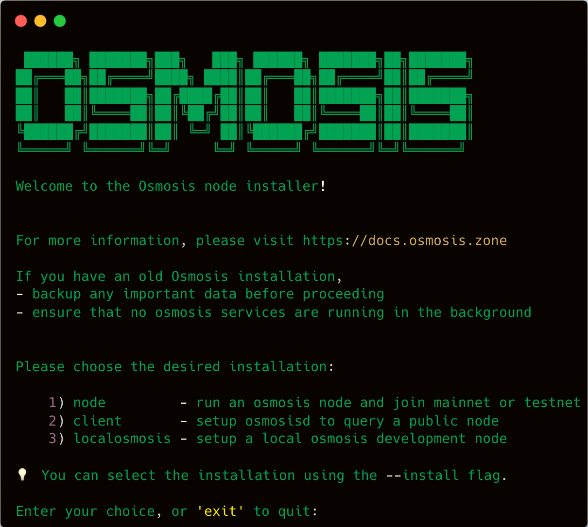

# Osmosis Installer 🧪 ⚙️

<p align="center">
  
</p>

The Osmosis Installer is a simple tool that provides an easy and streamlined way to install and configure Osmosis.

## ✨ Features

The Osmosis Installer offers the following key features:

- 🔧 **Dependency Installation**: Automatically installs the necessary dependencies for running Osmosis.

- 🌐 **Network Joining**: Allows you to choose between joining the testnet or mainnet.

- ⬇️ **Binary Download**: Downloads the Osmosis binary for the selected network.

- ⚙️ **Configuration Customization**: Provides options for customizing your Osmosis configuration.

- 🔌 **Background Service Setup**: Sets up either cosmovisor or osmosisd as background services for continuous operation.

##  Installation

To install `osmosisd`, follow these steps:

1. Open your terminal.

2. Run the following command:

```bash
source <(curl -sL https://get.osmosis.zone/run)
```

> ⚠️ Requires `wget` to be present in the machine

This command will download and execute the Osmosis Installer script.

Follow the on-screen instructions to complete the installation. The installer will guide you through the installation process, allowing you to make choices such as selecting the installation type (node or client) and customizing various settings.

> 💡 Optional Flags:
> You can use some flag to specify the choices. For example, if you want to install the node, you can use the `--install node` flag. If you want to install the client, you can use the `--install client` flag.

### Further Optimizations

#### Adding Swap

Adding Swap Space
For optimal performance, it is recommended to have at least 64GB of RAM when running an Osmosis node. If your system does not meet this requirement, setting up swap space can help ensure smooth operation and prevent out-of-memory (OOM) errors.

To add swap space to your system, follow these steps:

1. Calculate the additional swap space needed: Subtract the amount of RAM you have from 64GB to determine the required swap space.
For example, if you have 32GB of RAM, you would need to add 32GB of swap space.

2. Open a terminal and execute the following commands:

```bash
sudo swapoff -a
sudo fallocate -l <swap_size>G /swapfile
sudo chmod 600 /swapfile
sudo mkswap /swapfile
sudo swapon /swapfile
sudo cp /etc/fstab /etc/fstab.bak
echo '/swapfile none swap sw 0 0' | sudo tee -a /etc/fstab
```

Replace <swap_size> with the size of the additional swap space you calculated. For example, if you need to add 32GB of swap space, replace <swap_size> with 32.

3. Verify that the swap space has been successfully added by executing the following command:

```bash
sudo swapon --show
```

#### Increasing Open File Limits

In Linux, the number of files limit affects the maximum number of connections a node can have,
By default, the operating system imposes limits on the number of files a process can open simultaneously to prevent resource exhaustion.

To increase the open file limits, follow these steps:

1. Open the terminal and run the command:
   ```bash
   sudo <text_editor> /etc/security/limits.conf
   ```
   Replace `<text_editor>` with your preferred text editor (`nano`, `vi`, etc.).

2. Add the following lines at the end of the file:
   ```
   * hard nofile 65536
   * soft nofile 65536
   ```

3. Save and close the file.

4. Run the command:
   ```bash
   sudo <text_editor> /etc/pam.d/common-session
   ```

5. Add the following line at the end of the file:
   ```
   session required pam_limits.so
   ```

6. Save and close the file.

7. Restart your system.
